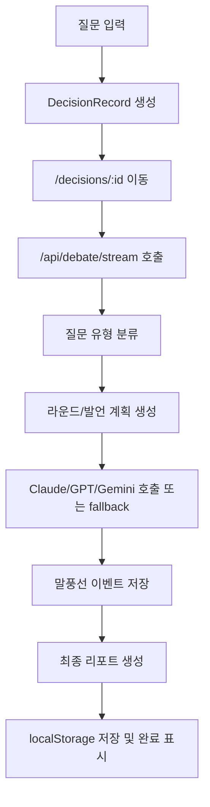

# AI 톡톡 / AI 3-Mind Council 서비스 구조서

## 1. 서비스 목적

사용자가 하나의 질문을 넣으면 3개의 AI 캐릭터가 서로 다른 관점으로 짧게 대화하고, 마지막에 사용자가 이해하기 쉬운 결론을 제공합니다.

이 서비스의 핵심은 "정답 제공"보다 "AI들이 관점 충돌을 보여주는 읽는 재미"입니다.

## 2. 핵심 UX

- 홈에서 질문만 입력해도 바로 시작됩니다.
- 기본값은 심플 모드입니다.
- 심플 모드는 AI 셋이 카페에서 가볍게 수다 떨며 태클 거는 느낌입니다.
- 심층 모드는 같은 캐릭터성을 유지하되 근거와 조건을 조금 더 길게 봅니다.
- 결과 화면은 STEP 1~4로 진행 상태를 보여줍니다.
- 최종 결론은 마지막 리포트 영역에서만 보여줍니다.
- 최근 토론 목록에서 완료/진행/중단 상태를 볼 수 있습니다.

## 3. 심플 모드 흐름

1. 사용자는 질문만 입력합니다.
2. 시스템은 질문을 자동 분류합니다.
3. Claude, GPT, Gemini가 짧게 주고받습니다.
4. 속마음은 캐릭터별로 짧게 표시합니다.
5. 최종 리포트는 `오늘의 결론`, `한 줄 추천`, `조심할 점`, `바로 할 일` 중심으로 짧게 정리합니다.

## 4. 심층 모드 흐름

1. 사용자는 질문을 입력합니다.
2. 선택 항목으로 현재 선택지, 우려되는 점, 집중 분석 영역을 넣을 수 있습니다.
3. 시스템은 질문 유형을 분류하고 역할형 토론을 구성합니다.
4. Claude는 가능성, GPT는 리스크, Gemini는 판단 기준을 봅니다.
5. 제약/사업/인사 주제는 최종 리포트에서 근거, 리스크, 조건, 다음 액션을 유지합니다.

## 5. 사용자 입력에서 최종 리포트까지

## 6. AI 역할 정의

- Claude: 부드럽고 사람 중심입니다. 분위기를 살리면서 가능성을 봅니다.
- GPT: 차갑고 현실적입니다. 모순, 비용, 실패 가능성을 짧게 찌릅니다.
- Gemini: 중재자입니다. 두 의견을 묶고 판단 기준을 세웁니다.

## 7. 질문 유형 분류

현재 주요 유형은 아래와 같습니다.

- `chat`: AI와 말하는 법, AI 수다형 질문
- `fun`: 회식, 음식, 일상 선택
- `tech`: AI 활용, 기술 도입
- `pharma`: 제약/의료
- `business`: 사업/제품 출시
- `people`: 채용/조직/인사
- `general`: 위에 명확히 속하지 않는 일반 의사결정

## 8. fallback 처리 방식

API 호출이 실패하거나 답변이 너무 일반적이면 서버 내부 fallback 문장을 사용합니다.

fallback도 질문 유형, 직전 발언, AI 캐릭터를 반영해야 합니다. 예를 들어 회식 질문은 회식 맥락으로, 제약 질문은 안전성/규제 맥락으로 돌아와야 합니다.

## 9. 토론 생성 로직

- Round 1: 각자 첫 입장
- Round 2: 교차 반박, 기본 3회
- Round 3: 한 줄 정리 또는 근거 검증
- 최종 리포트: 토론 말풍선과 분리해서 마지막에 표시

## 10. 속마음 생성 로직

- 속마음은 짧게 표시합니다.
- 심플 모드는 이모지를 사용합니다.
- 같은 토론 안에서 같은 속마음이 반복되지 않아야 합니다.
- 속마음은 유머가 있어도 사용자 조롱은 금지합니다.

## 11. 토큰 절약 전략

- 매 발언마다 전체 대화를 보내지 않고 `직전 발언 + 짧은 누적 요약` 중심으로 구성합니다.
- 심플 모드는 1~2문장으로 제한합니다.
- 빠른 QA는 `?dev=quick`으로 Round 1만 검사할 수 있습니다.
- API 실패 시 추가 호출을 반복하지 않고 내부 fallback을 사용합니다.

## 12. 향후 확장 구조

- localStorage를 Supabase 또는 회사 DB로 교체
- 회사 API Gateway로 Claude/GPT/Gemini 호출 통합
- 토론 공유 링크
- PDF/보고서 다운로드
- 사용자별 히스토리
- 비용 모니터링과 토큰 제한

