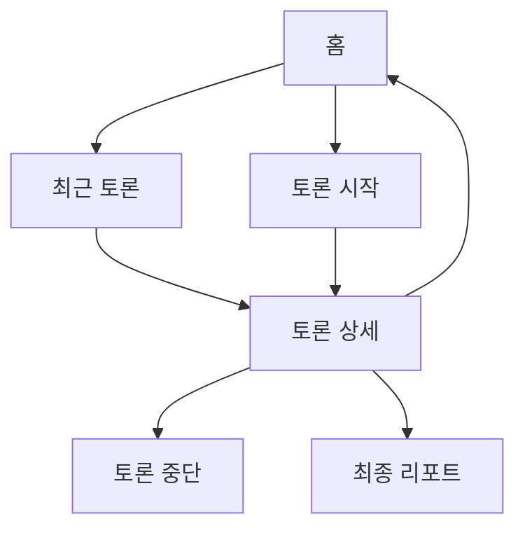

# IA / 메뉴 구조 문서

## 1. 현재 메뉴 구조

## 2. 홈

홈은 모바일 앱 첫 화면입니다.

구성:

- 히어로 이미지
- 심플/심층 선택
- 질문 입력
- 토론 시작 버튼
- 최근 토론 목록

기본값은 심플입니다.

## 3. 심플 모드 UX

- 질문만 입력합니다.
- 추가 설정은 사용자에게 보이지 않습니다.
- 내부값:
  - `councilMode = open_debate`
  - `banterLevel = spicy`
  - `rebuttalRotations = 3`

## 4. 심층 모드 UX

심층을 누르면 추가 입력 항목이 펼쳐집니다.

- 현재 선택지
- 우려되는 점
- 집중 분석 칩

내부값:

- `councilMode = role_based`
- `banterLevel = light`
- `rebuttalRotations = 2`

## 5. 결과 화면

구성:

- 뒤로가기
- 상태 배지
- 수정 시간
- 빠르게 버튼
- 중단 버튼
- 질문 제목
- STEP 1~4 진행 바
- Live Debate
- Final Report

## 6. 최근 토론

최근 토론은 localStorage의 `councilDecisions` 배열을 최신순으로 보여줍니다.

표시:

- 상태: 진행중 / 중단됨 / 완료 / 오류
- 질문 제목
- 생성일
- 삭제 버튼

카드를 누르면 `/decisions/:id`로 이동합니다.

## 7. 저장/조회 흐름

현재는 localStorage 기반입니다.

- 생성: `saveDecision`
- 조회: `loadDecisions`, `getDecision`
- 수정: 같은 id로 `saveDecision`
- 삭제: `deleteDecision`

개발팀 정식 개발 시에는 DB 테이블로 교체하면 됩니다.

## 8. 향후 확장 메뉴

- 공유 링크
- PDF 다운로드
- 내 토론 보관함
- 즐겨찾기
- 설정
- 팀/조직별 히스토리
- 관리자 비용 모니터링

